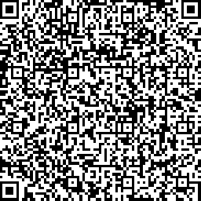
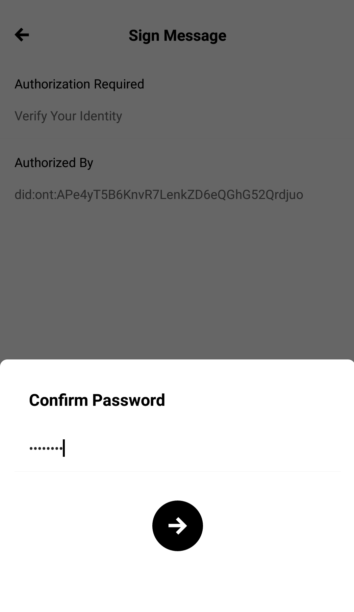
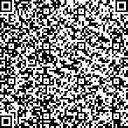
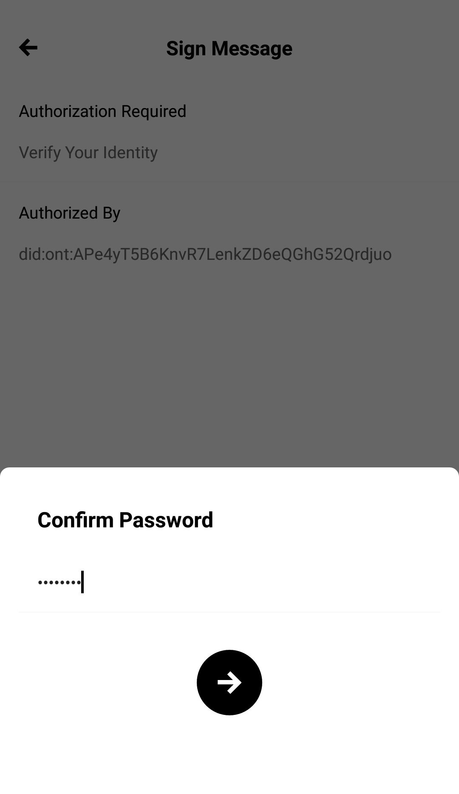

# Operation Guide

## Decentralized account remodeling

The core idea of the **decentralized** **remodeling** is allowing for the centralized account system to keep functioning with no change, while linking these accounts with an ONT ID public key and then carry out authentication by signing and verifying the corresponding ONT ID private key for the accounts.

### Registration process remodeling

First, the user registers a self-sovereign ONT ID using ONT Auth.


Next, traditional web apps prepare the account information and register in the following manner.

  **i.** Fill in the relevant information

**ii.** Check for redundancy with older existing accounts

**iii.** Lock the new account and cache the registration information


The cache bounded with the session should be cleared upon expiration


The web app uses the Signing SDK or the Restful API's `verify` method and generates QR code based on the data from the response.


It is advised for developers to issue a reminder to download ONT Auth and register ONT ID at this point.


**i.** The method parameter is preset to `register`

**ii.** Signing SDK: Invoke `signingSdk.verify("register", null)`

**iii.** Restful API: Invoke `GET/api/v1/ontid/verify/register`

**iv.** Fetch the `result` from the returned data and generate QR code

An example of the returned data upon successful registration:

```yaml
{
    "action": "register",
    "error": 0,
    "desc": "SUCCESS",
    "result": {
        "domain": "on.ont",
        "action": "signMessage",
        "id": "211828f6-da17-4cb2-9a6d-0004018b8072",
        "params": {
            "callback": "http://192.168.50.4:8099/api/v1/ontid/invoke",
            "type": "ontid",
            "message": "msg",
            "ishex": false
        },
        "version": "v1.0.0"
    },
    "version": "v1"
}
```

Here's the QR code generated using the `result` from the above data.



**i.** The user scans the QR code using ONT Auth, signs the message and sends it to the signing server



**ii.** Signing-server says receives the signed data sent by ONT Auth  and verifies it. If the verification is carried out successfully, the `ONT ID` used to carry out the signature is returned to the web app.

```yaml
{
    "action": "registerResult",
    "error": 0,
    "desc": "SUCCESS",
    "result": {
        "success": "1",
        "action": "register",
        "id": "211828f6-da17-4cb2-9a6d-0004018b8072",
        "ontid": "did:ont:APe4yT5B6KnvR7LenkZD6eQGhG52Qrdjuo"
    },
    "version": "v1"
}
```

The web app then automatically links the account and the `ONT ID`, and the cached information is set as the account information.

### Login process remodeling

The web app uses the Signing SDK or the Restful API's `verify` method with an account, and a QR code is generated from the returned data. 

**i.** The method parameter is preset to `login`

**ii.** Signing SDK: Invoke `signingSdk.verify("login", null)`

**iii.** Restful API: Invoke `GET/api/v1/ontid/verify/login`

**iv.** Fetch the `result` from the returned data and generate QR code

Sample code of the response after a successful login action:

```yaml
{
    "action": "login",
    "error": 0,
    "desc": "SUCCESS",
    "result": {
        "domain": "on.ont",
        "action": "signMessage",
        "id": "c9ca1740-9699-425e-8e4c-efb44e476b32",
        "params": {
            "callback": "http://192.168.50.4:8099/api/v1/ontid/invoke",
            "type": "ontid",
            "message": "msg",
            "ishex": false
        },
        "version": "v1.0.0"
    },
    "version": "v1"
}
```

The QR code generated from the result above:



The web app uses the Signing SDK or invokes the Restful API `verifyResult` method. 

**i.** The success response returned from above is passed as a parameter. The result of this execution is then polled.

**ii.** Signing SDK: Invoke `signingSdk.verifyResult(id)`

**iii.** Restful API: Invoke `(GET) /api/v1/ontid/result/{id}`

Next, the user scans the above QR code and signs it, and the result is sent to the signing server.



The signing server receives the signed data and carries out verification. If successful, the success response is returned to the web app, and if failed the failure response is returned to the web app.

```yaml
{
    "action": "loginResult",
    "error": 0,
    "desc": "SUCCESS",
    "result": {
        "success": "1",
        "action": "login",
        "id": "c9ca1740-9699-425e-8e4c-efb44e476b32",
        "ontid": "did:ont:APe4yT5B6KnvR7LenkZD6eQGhG52Qrdjuo"
    },
    "version": "v1"
}
```

### Critical on-chain action remodeling

1. Define the on-chain action template.

```yaml
{
	"domain": "on.ont",
	"enableONS": true,
	"defaultPayer": "AFmseVrdL9f9oyCzZefL9tG6UbvhUMqNMV",
	"actions": [{
		"type": "register",
		"onchainRec": false
	}, {
		"type": "login",
		"onchainRec": false
	}, {
		"type": "sourcing",
		"onchainRec": true,
		"payer": "",
		"qrcodeUrl": "http:192.168.50.4:8099/qrcode/",
		"callback": "http:192.168.50.4:8099/callback/"
	}]
}
```

2. Determine whether to transmit the data onto the chain or to carry out signature verification and the action to be performed.

**i.** If `onchainRec` value is set as `true` it signifies that the message can be sent to the chain, and `false` mean that it needs to be verified again.

**ii.** The on-chain transmission action needs the `qrcodeurl` and callback `configuration`.

**iii.** The web app saves the on-chain action's transaction parameters and since `id` is a unique identifier, these parameters can be fetched with the combination of `qrcodeurl` + id. So, when using the SDK or API method, id needs to be passed as a parameter in the following way-

Signing SDK: Invoke `signingSdk.verify("sourcing",id)`

Restful API: Invoke `(GET) /api/v1/ontid/verify/sourcing?id=xxx`

Next, result is fetched from the response and the QR code is generated using this.\(Can be generated using the plugin\)

iv. ONT Auth scans the QR code and fetches the transaction parameters, creates the signature request, and sent to the signing server.

v. Signing server is responsible for ONT Auth signature verification. Once the verification is complete the result is sent back to the web app using the callback configuration. The web app then carries out the on-chain transmission action.

3. For any on-chain actions, implement the corresponding smart contracts.

4. Implement other off-chain actions and logic.

5. Define the on-chain transmission operation.

### Centralized custody scheme

To make the user exeprience as smooth and as user-friendly as possible, and to allow the users to transition from a **centralized** identity verification system to a **self-sovereign** identity system, you may choose to go with the [Centralized custody scheme](https://github.com/leej1012/ONTID-course/blob/master/ontid-course.md#cent-id). But, that is beyond the scope of this tutorial.

### 


