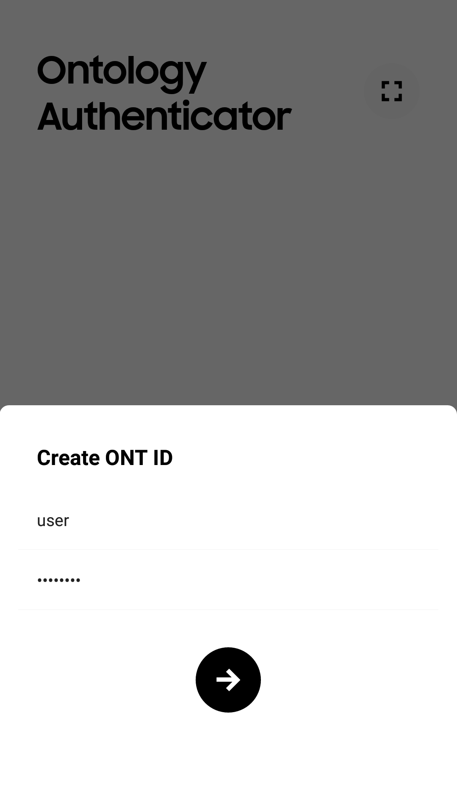
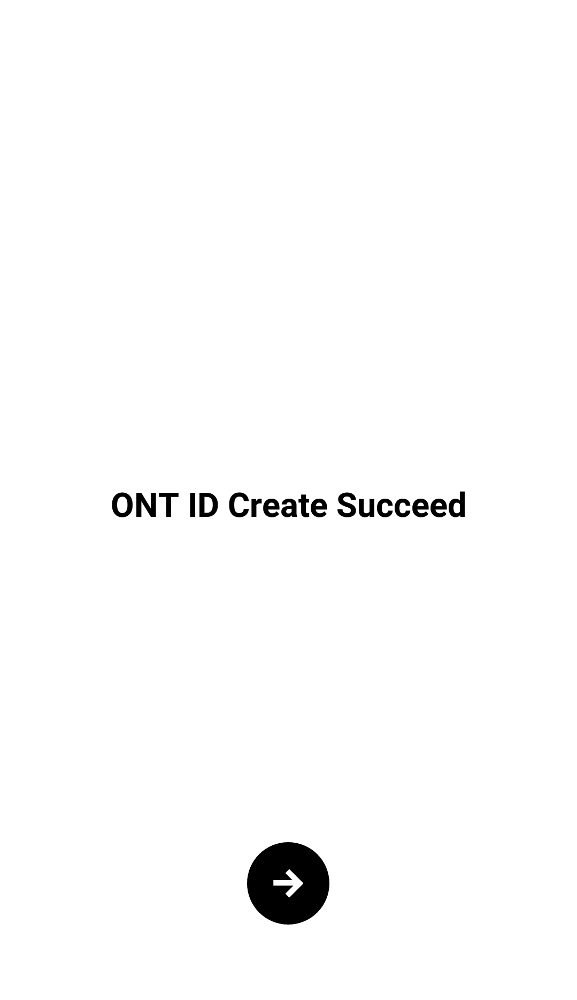

# Operation Guide

## Decentralized account remodeling

The core idea of the **decentralized** **remodeling** is allowing for the centralized account system to keep functioning with no change, while linking these accounts with an ONT ID public key and then carry out authentication by signing and verifying the corresponding ONT ID private key for the accounts.

### Registration

1. The user registers a self-sovereign ONT ID using ONT Auth.

2. Traditional web apps prepare the account information and register in the following manner.
  i. Fill in the relevant information
  ii. Check for redundancy with older existing accounts
  iii. Lock the new account and cache the registration information
